# FireFlow - 动态防火墙规则管理系统

一个专为多云环境设计的智能防火墙规则管理工具，支持动态 IP 更新和统一管理界面。

项目地址: [Github](https://github.com/lm379/fireflow)  [Gitee](https://gitee.com/lm379/fireflow) [CNB](https://cnb.cool/lm379/fireflow)

## 🔧 功能特性

### ✅ 已实现
- **数据存储**：使用 SQLite 数据库存储配置和规则
- **多云支持**：腾讯云轻量应用服务器、阿里云 ECS/轻量应用云服务器、华为云 ECS/Flexus（仅支持中国站）
- **智能更新**：定时任务自动检测并更新 IP 地址
- **管理界面**：直观的 Web 管理控制台
- **API 接口**：完整的 RESTful API 支持

## 🌐 前端界面

FireFlow 提供了现代化的 Web 管理界面，基于 Vue 3 + TypeScript 开发。

- **GitHub**: [FireFlow-Frontend](https://github.com/lm379/fireflow-frontend)
- **cnb**: [FireFlow-Frontend](https://cnb.cool/lm379/fireflow-frontend)
- **技术栈**: Vue 3 + TypeScript + Vite

## 🚀 快速开始

### Docker 部署（推荐）
本项目支持多平台镜像仓库，您可以根据需要选择拉取：
- **Docker Hub**: `lm379/fireflow:latest`
- **GitHub Container Registry (ghcr)**: `ghcr.io/lm379/fireflow:latest`
- **CNB 制品库**: `docker.cnb.cool/lm379/fireflow:latest`
- **华为云 SWR**: `swr.cn-southwest-2.myhuaweicloud.com/lm379/fireflow:latest`

中国大陆推荐选择 `CNB制品库`

```bash
docker run -d \
    --name fireflow \
    -p 9686:9686 \
    -v ./configs:/app/configs \
    lm379/fireflow:latest
    # ghcr.io/lm379/fireflow:latest
    # docker.cnb.cool/lm379/fireflow:latest
    # swr.cn-southwest-2.myhuaweicloud.com/lm379/fireflow:latest
```

### 二进制部署

1. 前往 [Release 页面](https://github.com/lm379/FireFlow/releases) 下载对应架构的二进制包
2. 解压并运行：
   以linux-amd64(x64)为例   
   ```bash
   tar -xzf fireflow-linux-amd64.tar.gz
   mv fireflow-linux-amd64 fireflow
   ./fireflow
   ```


## 🛡️ 账号与安全

- **默认账号**：`admin`
- **默认密码**：`password`
- **首次登录后请务必修改密码！**

### 密码重置方法
- 二进制运行环境下：
  ```bash
  ./fireflow reset
  ```
- Docker 运行环境下：
  ```bash
  docker exec -it fireflow ./fireflow reset
  ```

## ⚠️ 重要提醒

> **安全须知**
> - 请妥善保管各云厂商的 API 密钥
> - 不要将服务端口暴露到公网
> - **请勿设置过于简单的密码（如123456、password等），否则存在极高的安全风险。**
> - **因弱密码或未及时修改默认密码或自己泄露API密钥等导致的任何安全问题，均由使用者自行承担，项目及作者不承担相关责任。**

## ⚙️ 配置指南

> **说明**：本程序提供的区域信息可能不完全准确，请以云厂商控制台为准。如果选项中没有目标区域，可以手动输入。

### 🔹 腾讯云（轻量应用服务器）

#### 1. 获取访问密钥（AK/SK）

**推荐使用子账号，安全性更高**

1. 访问 [腾讯云 CAM 控制台](https://console.cloud.tencent.com/cam)
2. 创建子用户，选择「编程访问」
3. 授予 `QcloudLighthouseFullAccess` 权限
4. 保存生成的 `secret_id`（AK）和 `secret_key`（SK）

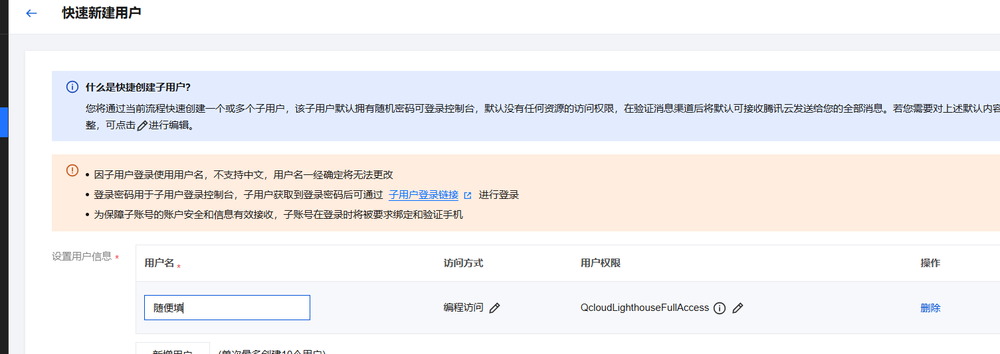

#### 2. 获取实例 ID

1. 进入腾讯云轻量应用服务器控制台
2. 找到目标服务器，复制实例 ID

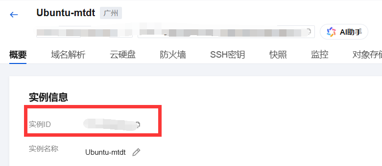

### 🔹 阿里云（ECS）

#### 1. 获取访问密钥（AK/SK）

**推荐使用 RAM 子账号**

1. 访问 [阿里云 RAM 控制台](https://ram.console.aliyun.com/users)
2. 创建用户，勾选「使用永久 AccessKey 访问」

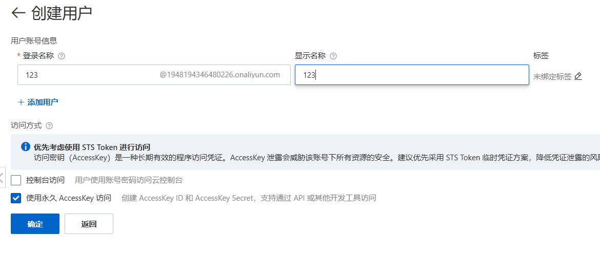

3. 为用户授予 ECS 管理权限

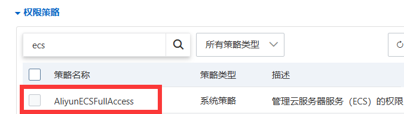

#### 2. 获取安全组 ID

1. 访问 [阿里云 ECS 控制台](https://ecs.console.aliyun.com/)
2. 选择对应地域，进入「网络与安全」→「安全组」
3. 复制安全组 ID（格式：`sg-xxxxxxxxx`）

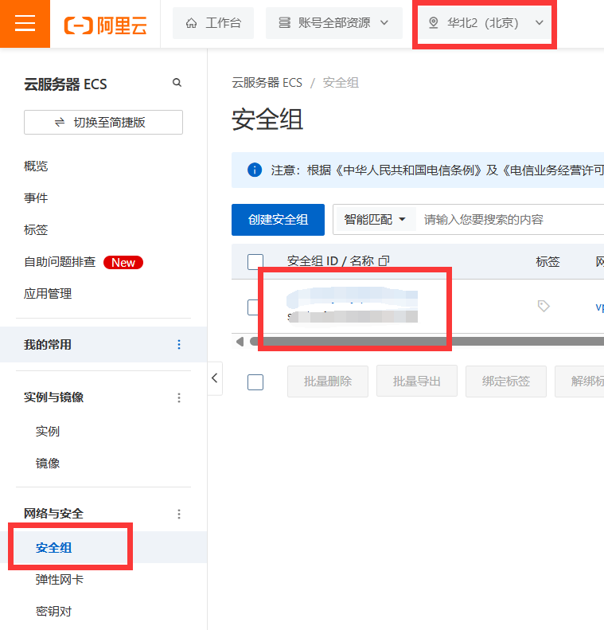

### 🔹 华为云（ECS/Flexus）

> **兼容性说明**：华为云 ECS 和 Flexus 云服务器使用相同的 API，理论上支持所有使用 VPC 网络的云服务器。

#### 1. 获取访问密钥（AK/SK）

**强烈推荐使用 IAM 子用户**

1. 访问 [华为云 IAM 控制台](https://console.huaweicloud.com/iam/#/iam/users)
2. 创建用户，勾选「编程访问」和「访问密钥」

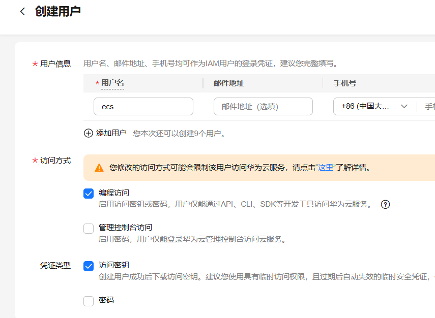

3. 创建用户组并授权 ECS 相关权限

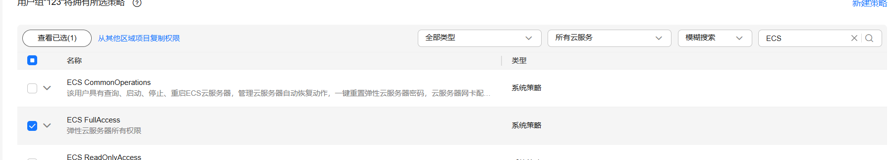

**主账号密钥（不推荐）**

如需使用主账号，请访问 [我的凭证](https://console.huaweicloud.com/iam/#/mine/accessKey) 创建访问密钥。

> ⚠️ **安全警告**：主账号 Token 权限过高，泄露风险极大，强烈建议使用子账号。

#### 2. 获取 Project ID

访问 [我的凭证](https://console.huaweicloud.com/iam/#/mine/accessKey)，复制与服务器区域对应的项目 ID。

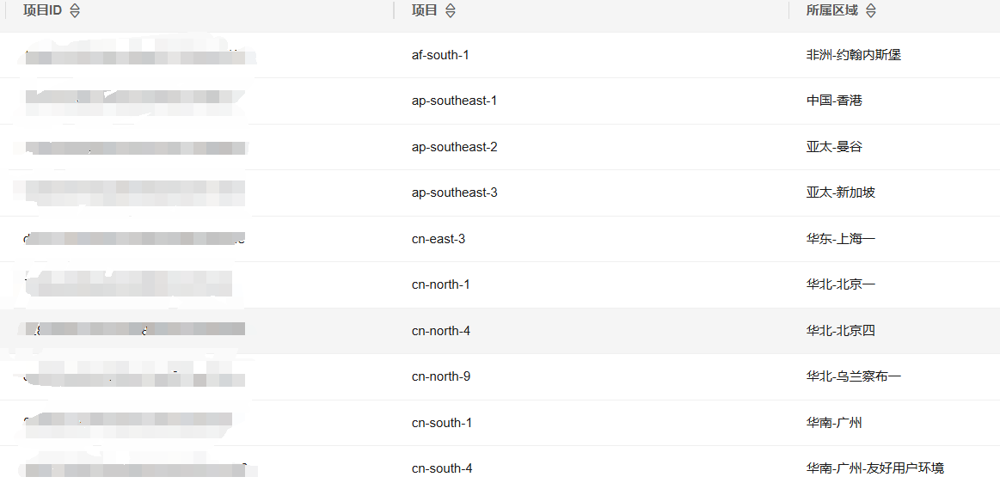

#### 3. 获取安全组 ID

1. 进入服务器所在地域的「虚拟私有云 VPC」控制台
2. 选择「访问控制」→「安全组」
3. 复制实例关联的安全组 ID

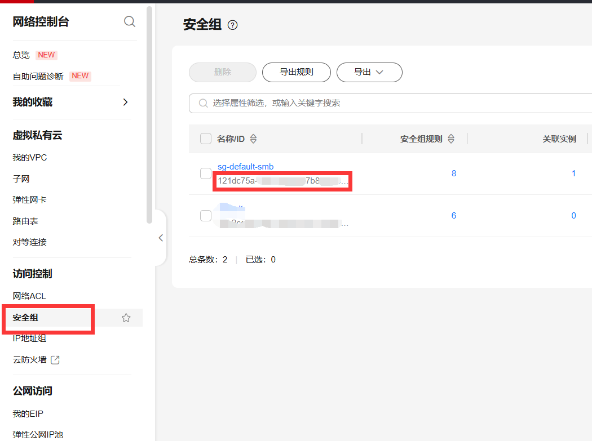

### 🔹 Azure

#### 1. 创建应用注册

1. 以管理员账号登录 [Azure 门户](https://portal.azure.com/)
2. 搜索并进入 "应用注册"

    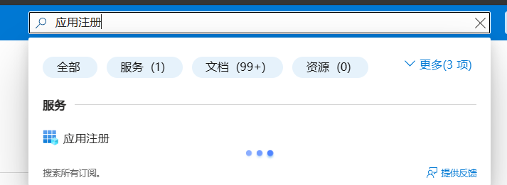

3. 点击 "新建注册"，输入应用名称，选择 "受支持的账户类型" 为 "任何组织目录中的账户和个人 Microsoft 账户"，然后创建。

    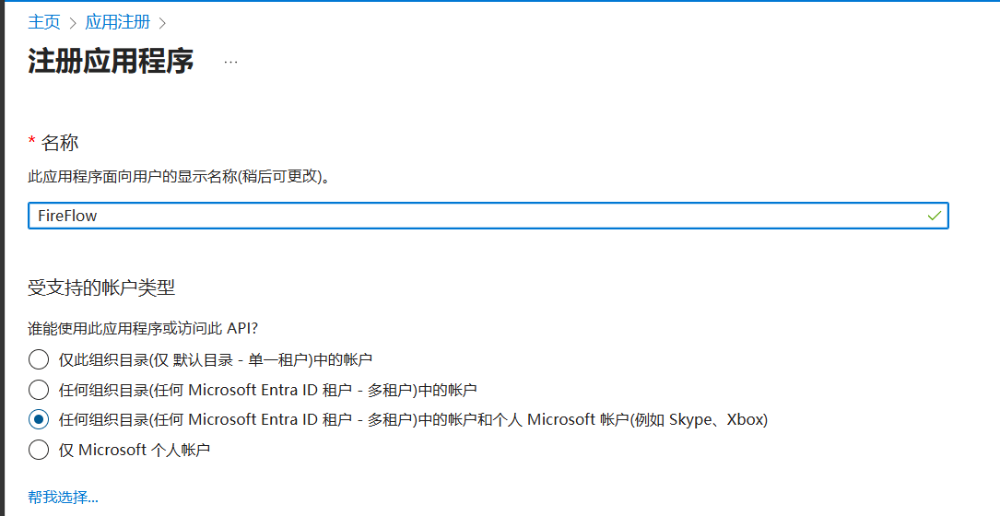   

4. 在应用概述页面，记录 "应用程序(客户端) ID"（对应 AK）和 "目录（租户）ID"（对应租户 ID）。

    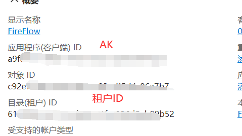

5. 点击左侧 "证书和密码"，创建新客户端密码，设置到期时间。

    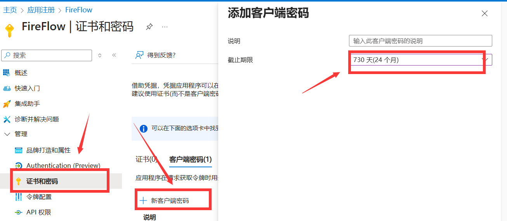

6. 记录生成的密码值（对应 SK）。  

    **注意：密码仅显示一次，务必妥善保存。如果遗忘，建议删除现有密码并重新创建。**

   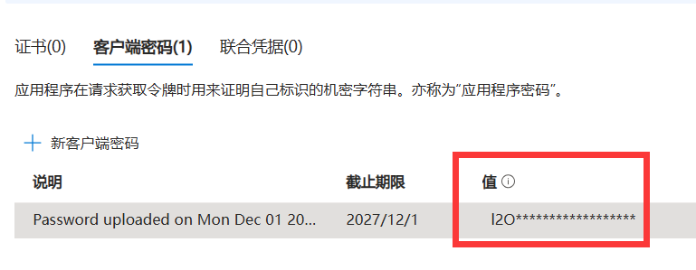

#### 2. 获取资源信息

1. 找到虚拟机对应的网络安全组。
2. 在安全组概述页面，记录 "网络安全组名称"（对应实例 ID/安全组 ID）、"资源组名称"（对应 Resource Group）和 "订阅 ID"（对应 Subscription ID）

    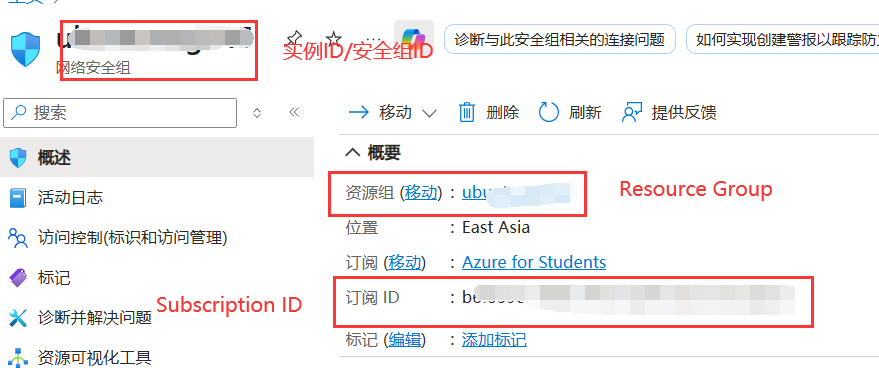

#### 3. 授权应用

1. 返回资源组，点击左侧 "访问控制" → "添加角色分配"

    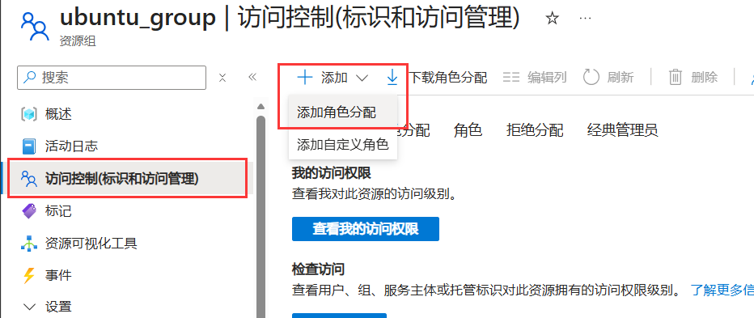

2. 搜索 "网络参与者" 角色，点击选中

   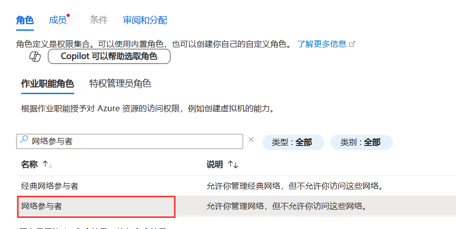

3. 点击 "成员" → "添加成员"，搜索并选择刚才创建的应用

   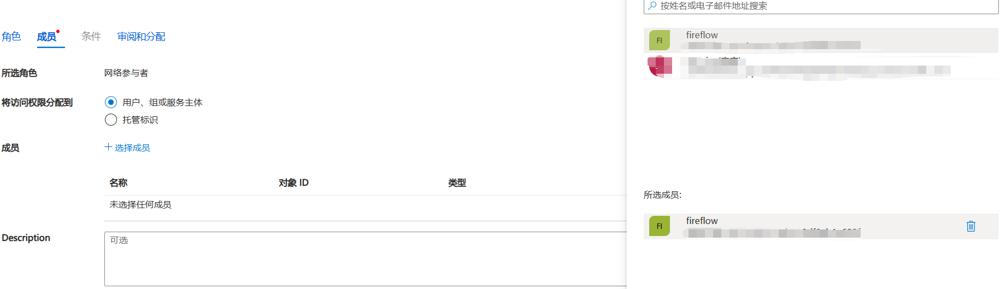

4. 点击 "审阅和分配" 完成授权。

5. 返回 FireFlow，输入上述信息，点击测试。如果成功，将显示当前安全组信息。